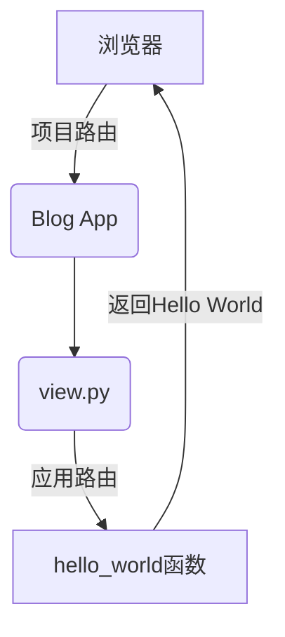

通过Django框架实现简单的个人博客，做为Python语言的入门项目，熟悉python语法及Django框架基础

<!--more-->


## 环境准备

- 安装Python

```shell
# 验证是否成功
python
# 退出交互模式
exit()
```

- Anaconda2 Python环境
- Django环境

```shell
pip install django==2.0
# 验证是否成功
django admin
```

- PyCharm IDE安装

## Django项目初体验

### 初识Django项目

- Django基本命令
  - startproject - 创建一个Django项目
  - startapp - 创建一个Django应用
  - check - 校验项目完整性
  - runserver - 本地建议运行Django项目
  - shell - 进入Django项目的Python Shell环境
  - test - 执行Django用例测试
  - makemigrations- 创建模型变更的迁移文件
  - migrate - 执行上一个命令创建的迁移文件
  - dumpdata - 数据库导出到文件
  - loaddata - 文件数据导入到数据库

- 创建一个Django项目

  ```shell
  django-admin startproject django_introduction
  ```

  进入项目根目录运行以下命令，启动项目

  ```shell
  python manage.py runserver
  ```

  

- Django项目目录介绍

  - django_introduction
    - \_\_init\_\_.py
    - settings.py - 项目配置文件
    - urls.py - 项目路由配置文件
    - wsgi.py
  - manager.py - 项目管理文件

### 初识Django应用

- Django应用 vs Django项目
  - 一个Django项目可以包含一组配置和若干个Django应用
  - 一个Django项目就是一个基于Django的Web应用 - 可直接运行
  - 一个Django应用就是一个可重用的Python软件包 - 不可直接运行
- Django应用目录介绍
  - views.py - 视图处理的地方
  - models.py - 定义模型的地方
  - admin.py - 定义Admin模块管理对象的地方
  - apps.py - 声明应用的地方
  - tests.py - 编写应用测试用例的地方
  - urls.py - (自行创建)管理应用路由的地方

- 创建一个应用

  ```shell
  python manage.py startapp blog
  ```

  

### HelloWorld

- **1.Django视图**

新建视图，在blog目录下的view.py中定义如下函数

```python
from django.shortcuts import render
from django.http import HttpResponse

# Create your views here.
def hello_world(request):
    return HttpResponse("Hello World")
```

如果想正常返回，还需要配置路由

- **2.Django路由**

配置路由绑定视图函数和url

分为2个层次：应用层次和项目层次

**1) 应用层次**

在blog目录下新建urls.py，添加如下配置, 注意hello_world不带括号

```python
from django.urls import path, include

import blog.views

urlpatterns = [
    path('hello_world', blog.views.hello_world)
]
```

**2) 项目层次**

项目根目录urls.py添加如下配置, blog/**转发到blog应用

```python
from django.contrib import admin
from django.urls import path, include

urlpatterns = [
    path('admin/', admin.site.urls),
    path('blog/', include('blog.urls'))
]
```

**3) 在项目设置中添加应用**

 项目settings.py中添加如下配置

```pyhton
INSTALLED_APPS = [
    'django.contrib.admin',
    'django.contrib.auth',
    'django.contrib.contenttypes',
    'django.contrib.sessions',
    'django.contrib.messages',
    'django.contrib.staticfiles',

    # myapp
    'blog.apps.BlogConfig',
]
```

**4) 运行项目**

```python
python manage.py runserver
# 访问
http://localhost:8000/blog/hello_world
```

Hello World流程


## Django模型层

### 模型层简介

- **什么是模型层**

连接数据库与视图的组件

- **为什么需要？**

屏蔽不同数据库间的差异

开发者更加专注于业务逻辑的开发

- **模型层相关配置**

项目中数据库配置，settings.py

```python
DATABASES = {
    'default': {
        'ENGINE': 'django.db.backends.sqlite3',
        'NAME': os.path.join(BASE_DIR, 'db.sqlite3'),
    }
}
```

### 创建博客文章模型

- 模型层定义字段
  - 数字类型 - InterField
  - 文本类型 - TextField
  - 日期类型 - DateTimeField
  - 自增ID - AutoField
  - 主键定义 - primary_key属性

- **定义模型**

在blog目录下models.py中，新建Article模型

```python
from django.db import models

class Article(models.Model):
    # 文章ID
    article_id = models.AutoField(primary_key=True)
    # 文章标题
    title = models.TextField()
    # 文章摘要
    brief_content = models.TextField()
    # 内容
    content = models.TextField()
    # 发布日期
    publish_date = models.DateTimeField(auto_now=True)

    def __str__(self):
        return self.title
```

- 模型迁移，将创建模型同步到数据库

```shell
# 运行一下命令后, 在blogmigrations目录下产生initial.py迁移文件
python manage.py makemigrations
# 运行迁移文件，同步到数据库
python manage.py migrate
```

### 初识Django Shell

- **是什么？**

Python Shell用于交互式的Python编程。Django Shell也类似，继承Django项目环境

- **为什么使用**

方便开发、方便调试、方便Debug

- **Django Shell使用**

```shell
# 进入交互式环境
python manage.py shell

>>> from blog.models import Article
>>> a = Article()
>>> a.title = 'Test Django Shell'
>>> a.brief_content = 'Test Django Shell, By Hyman'
>>> a.content = 'Test Django Shell, New Article, Main content'
>>> print(a)
Article object (None)
# 保存a
>>> a.save()
# 获取所有Article
>>> articles = Article.objects.all()
>>> article = articles[0]
>>> print(article.title)
Test Django Shell
>>> print(article.content)
Test Django Shell, New Article, Main content
```

### 初识Django Admin模块

- **是什么**

Django的后台管理工具，可以读取定义的模型元数据，提供强大的管理使用页面

- **为什么使用**

可以使用后台管理模型，简化操作。借助框架完成认证用户、模型管理、校验输入等功能

- **怎么使用**

1) 创建管理员用户

2) 登录页面进行管理

```shell
python manage.py createsuperuser
python manage.py runserver
# 访问
http://localhost:8000/admin
```

在后台查看Article模型，还需要将Article注册到admin

在blog目录下的admin.py中加入如下配置，刷新页面即可显示Article模型信息

```python
from django.contrib import admin
from .models import Article

admin.site.register(Article)
```

### 博客数据返回页面

blog目录下views.py新增方法

```python
def article_content(request):
    article = Article.objects.all()[0]
    title = article.title
    brief_content = article.brief_content
    content = article.content
    article_id = article.article_id
    publish_date = article.publish_date
    return_str =  'title: %s, brief_content: %s, content: %s, article_id: %s, publish_date: %s' % (title, brief_content, content, article_id, publish_date)
    return HttpResponse(return_str)
```

blog目录下urls.py新增路由

```python
urlpatterns = [
    path('hello_world', blog.views.hello_world),
    path('content', blog.views.article_content)
]
```

## Django视图与模版

### 实现静态博客页面

- **页面布局**

**1)首页**

**2)详情页**

- **Bootstrap及其栅格系统**

来自美国Twitter的前端框架

### Django的模板系统

- **模板系统简介**

视图文件不适合编码HTML，页面设计需要修改Python代码

模板系统定义了特有的标签占位符

- **模板系统语法**

  1)变量标签 

  ```python
{{ 变量 }}
  ```
  
  2)for循环
  
  ```python
  , 
  ```
  
  3)if...else 
  
  ```python
  , , 
  ```

### 使用模板系统

- 获取路径参数

```python
# urls.py
urlpatterns = [
    path('hello_world', blog.views.hello_world),
    path('content', blog.views.article_content),
    path('index', blog.views.get_index_page),
    # path('detail', blog.views.get_detail_page),
    path('detail/<int:article_id>', blog.views.get_detail_page),
]

# views.py
def get_detail_page(request, article_id):
    all_articles = Article.objects.all()
    curr_article = None
    for article in all_articles:
        if(article.article_id == article_id):
            curr_article = article
            break
    if(curr_article == None):
        return HttpResponse('未找到，换个ID试试。。。')
    section_list = curr_article.content.split('\n')
    return render(request, 'blog/detail.html',
                  {
                      'curr_article': curr_article,
                      'section_list': section_list,
                  })
```

- 


```python
def get_index_page(request):
    page = request.GET.get('page')
    if page:
        page = int(page)
    else:
        page = 1
    print('page param: ', page)
    all_article = Article.objects.all()
    # 每页3
    paginator = Paginator(all_article, 3)
    page_num = paginator.num_pages
    print('page num: ', page_num)
    page_article_list = paginator.page(page)
    if page_article_list.has_next():
        next_page = page + 1
    else:
        next_page = page
    if page_article_list.has_previous():
        previous_page = page - 1
    else:
        previous_page = page
    return render(request, 'blog/index.html',
                  {
                      'article_list': page_article_list,
                      'page_num': range(1, page_num + 1),
                      'curr_page': page,
                      'next_page': next_page,
                      'previous_page': previous_page,
                  }
                  )
```

### 排序

views.py

```python
top5_article_list = Article.objects.order_by('-publish_date')[:5]
```


[源码](<https://github.com/hyman213/django_introduction>)